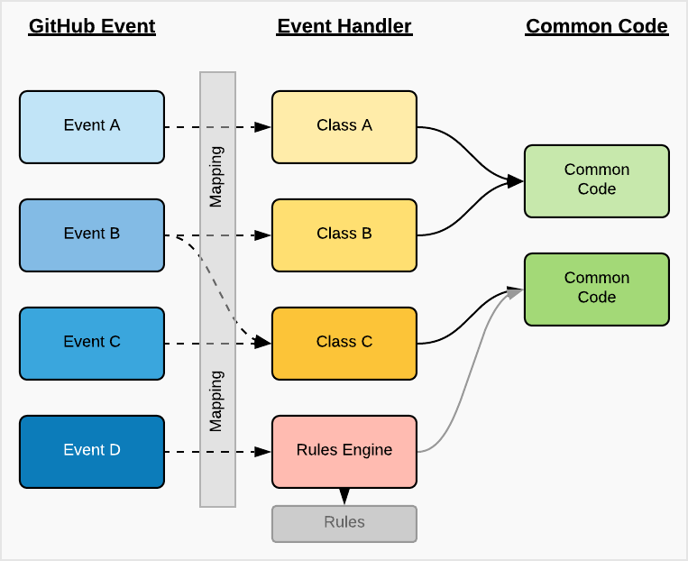

# probot-event-pattern-template

A template project that builds on top of Probot to provide Event-Handlers and Rules Engine support

*...I did it my way!* :microphone:

## Top

- [Introduction](#Introduction)
- [Concept](#Concept)
  - [Event-Handler-Concept](#Event-Handler-Concept)
  - [Rules-Engine-Concept](#Rules-Engine-Concept)
- [Configuration](#Configuration)
- [Tutorial](#Tutorial)

---

## Introduction

Probot is a great _framework_ for building your GitHub Apps, focusing on the process of...

*receive incoming GitHub events and how to react to them*,

a very basic concept, and for the moment let's omit any additional App registration and setup.

## Challenge

We are using configuration files in our Repo to help _control_ the behavior of the App!

That behavior is usually defined inside the code, maybe by **conditional statements**. This **tightly couples** the App code to your Repo configuration file.
In small GitHub Apps this might not be an issue but for more complex behavior this does not scale easily. Any change in the configuration or behavior requires a change in the code logic.

## Proposal

Let's try to **decouple the App behavior from the code** (externalize it) and make any code/module that uses the GitHub API as _atomic_ as possible.

Here are two simple concepts that can help to accomplish that

- Map incoming **GitHub events to handlers** via a mapping file (yaml)
- Use a **Rules Engine** to evaluate GitHub events and **apply handlers**

Both cases should eliminate long and complex **conditional statements** in the code and, if the code is **atomic** enough, allow for better **code readability and reusability**.

With an **externalized event workflow** we can control the behavior of the GitHub App without code changes or app restarts.

[Top](#Top)

---

## Concept



### Event-Handler-Concept

The mapping of the _GitHub event_ to the _eventHandler class_ is done during app initialization.

Sample _mapping file_

```yaml
issue.opened: [createComment1]
issue.closed: [createComment2, createComment1]
issue.edited: [rulesEngine]
issue.deleted: []
...
```

- createComment1
- createComment2
- rulesEngine

...these are classes in the **eventHandlers** folder.

```bash
src/
├── eventHandlers/
│   ├── common/
│   │   └── command.js
│   ├── createComment1.js
│   ├── createComment2.js
│   ├── eventHandlerMap.yml
│   ├── rules/
│   │   ├── issues-rule.json
│   │   └── testRules.json
│   └── rulesEngine.js
├── index.js
└── init.js
```

Any class that represents an _Event Handler_ must extend the `Command` class

```node
/**
 * Trying to implement the 'command pattern' in NodeJS
 * A poor man's interface
 */
class Command {
  // eslint-disable-next-line no-useless-constructor
  constructor () {
  }

  execute () {
    throw new Error('Method not implemented')
  }
}

module.exports = Command
```

### Rules-Engine-Concept

Any **event context** data can be used as a **fact** for rule conditions.

> Note: for the rules engine we use the ['json-rules-engine'](https://github.com/CacheControl/json-rules-engine) implementation.

Sample _event context_

```json
{
  "event": "issues",
  "payload": {
    "action": "opened",
    "issue": {
      "user": {
        "login": "jefeish",
...
```

Sample _rule condition_

```json
{
  "conditions": {
    "all": [
      {
        "fact": "payload.issue.user.login",
        "operator": "equal",
        "value": "jefeish"
      }
    ]
  },
  "event": {
    "type": "foobar",
    "params": {
      "message": "found the right 'login'"
    }
  }
}
```

[Top](#Top)

---

## Configuration

### Some important configuration files

| | |
|---|---|
| Event-Handler-Mapping | The mapping file that needs to be put in the Repos *.github* folder. A sample can be found [here](./src/eventHandlers/eventHandlerMap.yml) |
| Rule-Definitions | The Rules JSON files are part of your application. They are stored in, `./src/eventHandlers/rules/`. A sample can be found [here ](./src/eventHandlers/rules/issues-rule.json) |

[Top](#Top)

---

## Development

### Run the development sample

```bash
> npm run dev
```

[Top](#Top)

---

## Tutorial

[Top](#Top)

---
